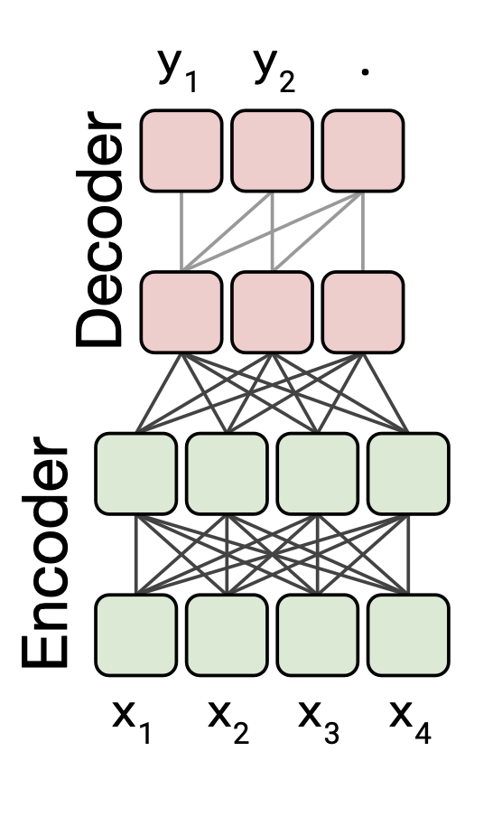
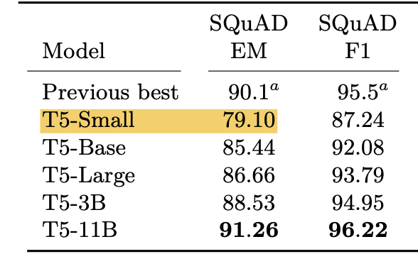

# Fine-tuning Google T5 small LMM on SQuAD dataset

## Repo structure

* `assets` - just assets like images for notebook or markdown
* `fine-tuned-t5-small` - `Pytorch` model exported after 1 EPOCH of fine-tuning, you can load it in hugging face with `from_pretrained()`
* `baseline.json` - Answers generated from base model on evaluation `dev-v2.0.json` set
* `dev-v2.0.json` - Downloaded from [SQuAD](https://rajpurkar.github.io/SQuAD-explorer/) dataset
* `eval_script.py` - [Official SQuAD eval script](https://rajpurkar.github.io/SQuAD-explorer/)
* `train-v2.0.json` - Downloaded training set from [SQuAD](https://rajpurkar.github.io/SQuAD-explorer/) dataset
* `fine-tuning-t5-small.ipynb` - Notebook which does work, you should be able to run it and it should just work. You will need a `GPU` with 12GB of VRAM

## Requirements to run

All requirements will be installed by `notebook` so you don't need to worry about it but those are for this specific example:

* `Pytorch with CUDA 11.8 support` please change this if you have different version
  * `!pip3 install torch torchvision torchaudio --index-url https://download.pytorch.org/whl/cu118` this is line to change
* `transformers`
* `accelerate>=0.26.0` - transormers asked for it, I did not use it explicitly, but you can if you want to
* `sentencepiece` - this is Google tokenizer which you need HuggingFace will use it in background for `T5Tokenizer()`

## Important

Please use repo just for educational use as there are many ways this process can be improved.
Mainly as internet is full of QA fine-tuning tasks most of them are relying on HuggingFace and you could do this
fine-tuning exercise in just 15 - 20 lines of code. In this repo I intentionally use just two HuggingFace classes:
* `T5ForConditionalGeneration`
* `T5Tokenizer`

Reasons to pull these two in are:
* We won't be coding up model on our own as that is not the point here and it is error prone
* Tokenizers are also error prone, as they have many nuances as implemented in some specific paper

I wanted to avoid upper issues, but everything else was done in pure `Pytorch` this is how you would train/fine-tune any model in `Pytorch`

## Task fine tune for Question Answering

There are many ways of fine-tuning which could work, in this example we took the simples one which is:
* add one layer on top of the model (we have this by calling `T5ForConditionalGeneration` as it adds LM head) and continue to train from that point onwards

Some parameter efficient fine-tuning methods which would help speed up the process like `LORA` can also be done here but
they would require mode Pytorch code and time to write it.


There are two ways in which we can do QA task:
* Learning where the answer is located in the given context or `Extractive`
* Learning to generate the correct answer based on context or `Abstractive` 

Here I decided on `Abstractive` for multiple reasons:
* Internet is flooded with BERT like QA tasks where you do it in `Extractive` way
* Our `T5` model chosen is `encoder-decoder` so it is able to generate stuff
* `T5-small` is just `200MB` and can be played with easily

## Dataset (SQuAD)

You can look it up at [SQuAD](https://rajpurkar.github.io/SQuAD-explorer/) official website. There is not any `EDA` done on the
dataset in the notebook, but you could analize length and number of examples for each topic.

Important things are that:
* Model has maximum dimension of sequence of `512` so we trim anything longer then that (it would be interesting to see how this affected training there are sure examples out there greater than 512)
* Each question in the dataset can have multiple answers
  * I took only the first answer for training but you could modify that to use more and have more examples

## Model chosen

* [T5](https://research.google/blog/exploring-transfer-learning-with-t5-the-text-to-text-transfer-transformer/)

Model is based on `encoder-decoder` architecture



This means that our model is capable of catching the semantics just like `BERT` is as we have the encoder part,
and also we are able to do text generation as `GPT` models.

## Evaluation results

### Running evaluation

To run the evaluation for `base` model just run:
```shell
python eval_script.py dev-v2.0.json baseline.json
```

The results are following:

```shell
{
  "exact": 34.42263960245936,
  "f1": 39.5366934720806,
  "total": 11873,
  "HasAns_exact": 68.94399460188934,
  "HasAns_f1": 79.18676815013714,
  "HasAns_total": 5928,
  "NoAns_exact": 0.0,
  "NoAns_f1": 0.0,
  "NoAns_total": 5945
}
```

To run the evaluation for fine-tuned model (ONLY 1 EPOCH) you can run:
```shell
python eval_script.py dev-v2.0.json finetuned.json
```

The results are:

```shell
{
  "exact": 46.8205171397288,
  "f1": 50.03194057891786,
  "total": 11873,
  "HasAns_exact": 43.55600539811066,
  "HasAns_f1": 49.98806182413807,
  "HasAns_total": 5928,
  "NoAns_exact": 50.07569386038688,
  "NoAns_f1": 50.07569386038688,
  "NoAns_total": 5945
}
```

## Interpretation of results

Metrics:
* `exact` - means exact match, it is basically `generated_string == target_string` (larger the better)
* `f1` - F1 score is just nice way of representing harmonic mean of precision and recall (larger the better)

We can see that only 1 epoch of fine-tuning worked well enough to raise scores, the authors of the paper fine-tuned this `T5 small`
up until these scores:



We are far away from this on just 1 epoch but eventually we would get there.

## Optimizer used for fine-tuning

Optimizer which I used is the same as in the original paper. You can see more info in the notebook.
The optimizer is `AdaFactor`. There is also some discussion which is useful to read for fine-tuning T5 [at hugging face forum](https://discuss.huggingface.co/t/t5-finetuning-tips/684)

## CUDA memory

In the notebook you will notice snippets of code like
```Python
import gc
import torch

some_variable_mapped_to_GPU = None
gc.collect()
torch.cuda.empty_cache()
```

This code makes sure that after running one batch of examples we can clean it from
GPU before we send in new batch. Reason is that CUDA will not clean memory fast enough so we won't be able to use GPU with 
batch size big enough. Here we first dereference it in Python and then clean it from CUDA as it will now that it does not need
it anymore. `gc.collect()` is important part of it as Python would not clean it on time. 

## What to watch out for if you want to modify this and what could be done next

In this notebook you need to watch out for:
* tokenizing and preparing the data, as special tokens and prepending text with prefixes used from original paper matter
* Optimizer and how you use it


What can be done more:
* some PEFT method like LORA or QLORA to speed up fine-tuning and see how much of `EM` and `F1` we could score with them
* training and inference have data loading bottleneck where `GPU` will fall to `0%` usage for second once the new batch of data needs to be streamed in
* Switch from `Abstractive` to `Extractive` QA learning
* Play with different layer freezing etc. 
* Do some grid search for different optimizer parameters
* Use some other optimizer